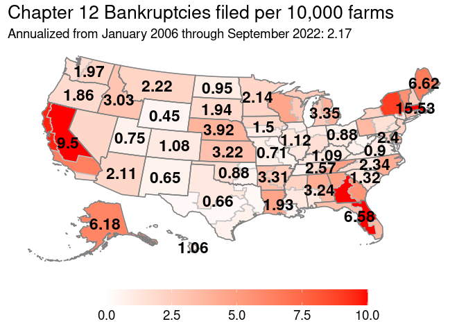
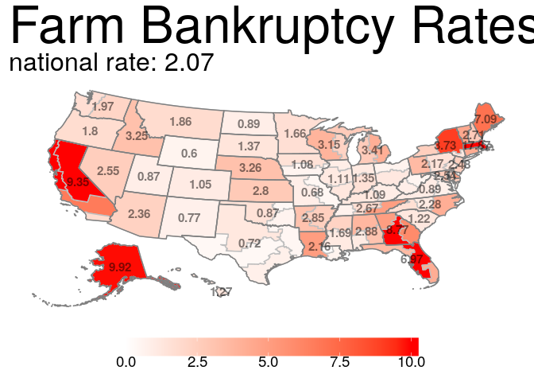
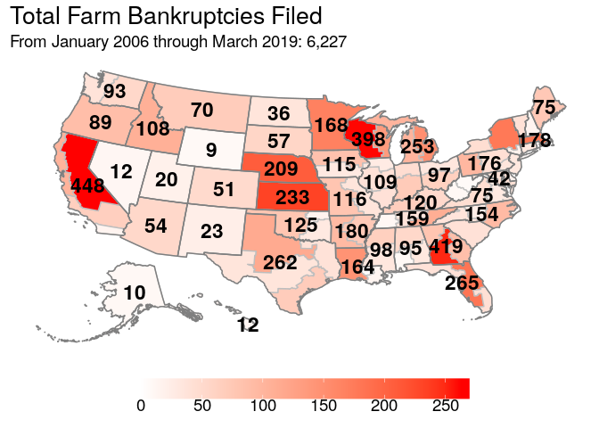
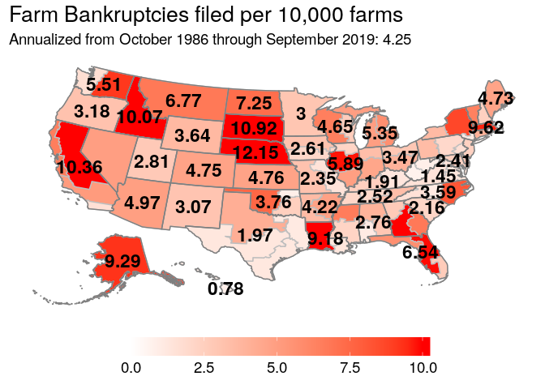
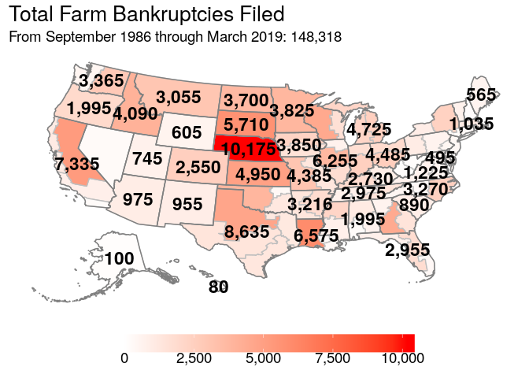
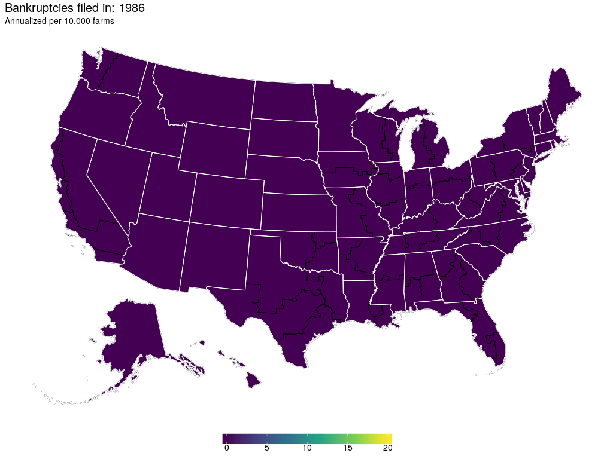
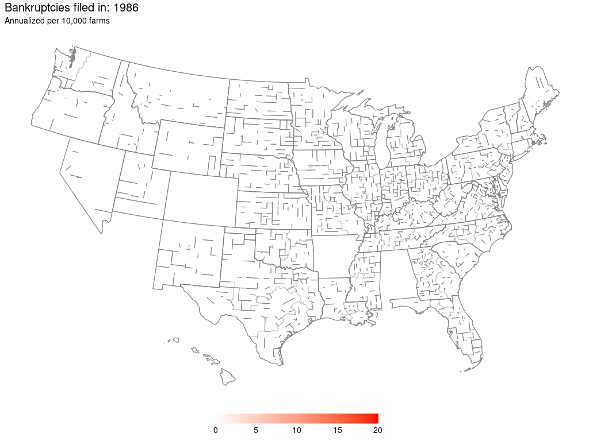

General Maps of Interest
========================

All bankruptcy filings since BAPCPA came into effect as a rate:

Map generally used in the agricultural outlook meeting at Ohio State:

Historical data, raw:

Historical rates of bankruptcy, animated:

Animated, but with red scale:

