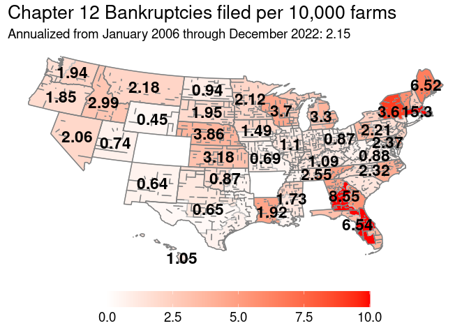
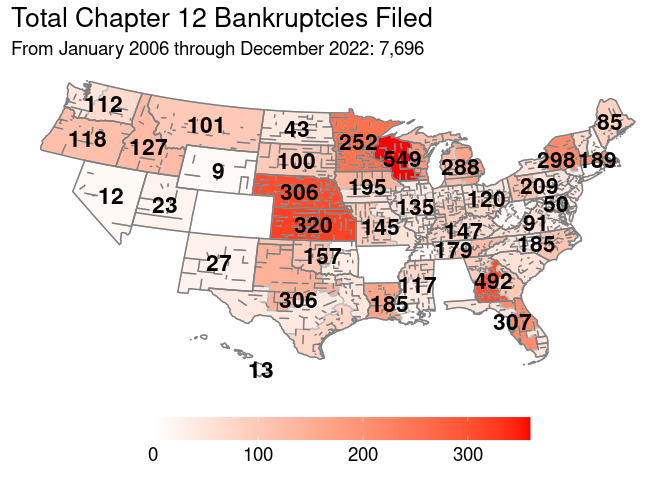
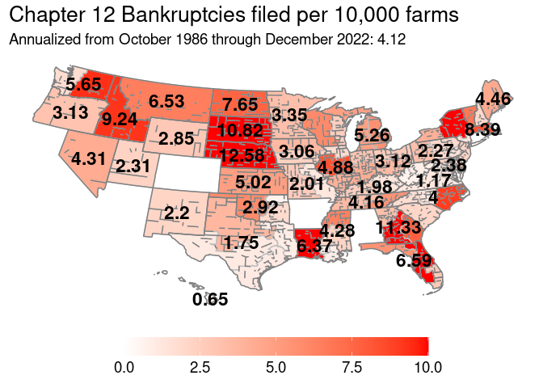
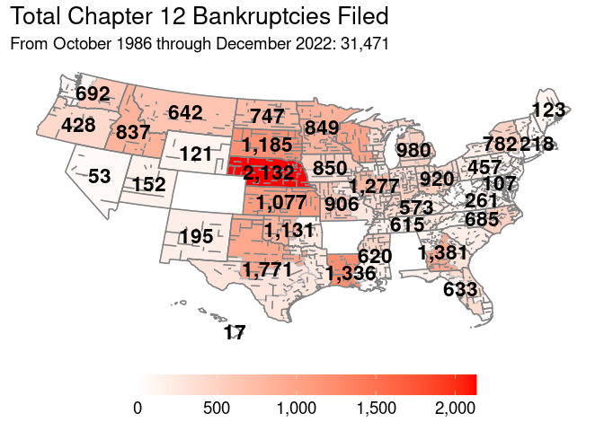
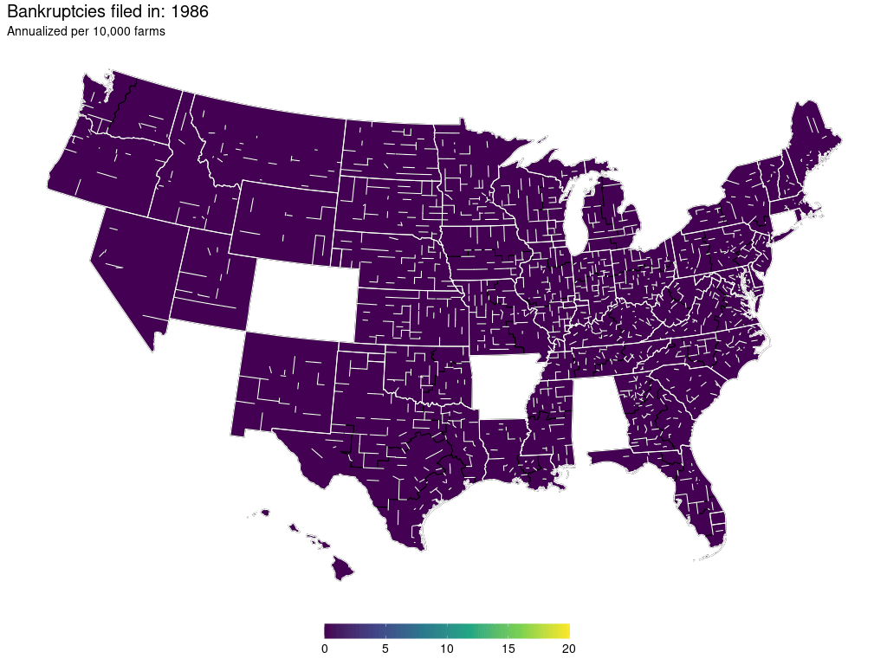

General Maps of Interest
========================

All bankruptcy filings since BAPCPA came into effect as a rate:

Map generally used in the agricultural outlook meeting at Ohio State:

Raw data of bankruptcy filings since BAPCPA was enacted:

Historical
==========

Since chapter 12 was an available bankruptcy option for farmers in
October of 1986:

Historical data, raw:

Historical rates of bankruptcy, animated (note, Arkansas changed its
reporting structure in 2018 going from reporting its districts
separately to combined reporting):

Animated, but with red scale:

