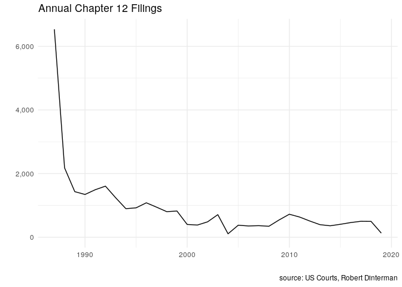
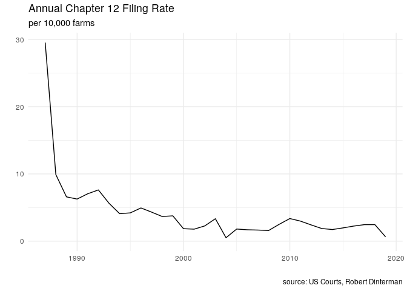
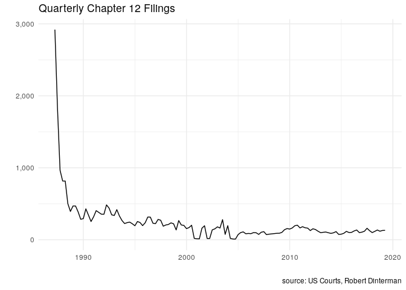
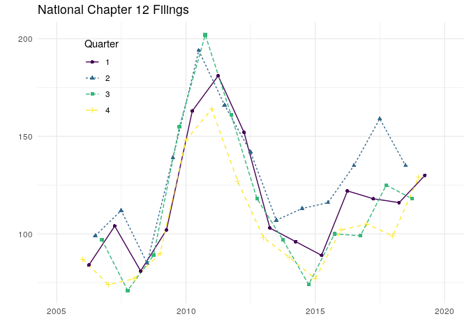
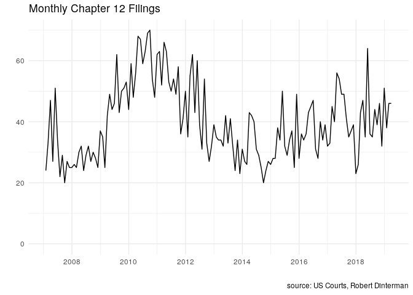
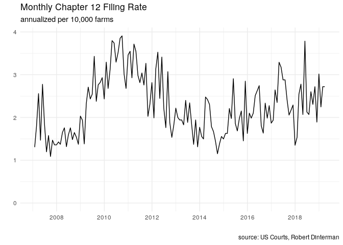

General Figures of Interest
===========================

Individual Series
-----------------









<!-- ## Combined Series -->
<!-- ```{r national-annual-quarterly} -->
<!-- annual_qtr <- quarter_nat %>%  -->
<!--   left_join(annual_nat) %>%  -->
<!--   mutate(year = year(DATE)) %>%  -->
<!--   fill(CHAP_12_nat, .direction = "up") -->
<!-- ``` -->
