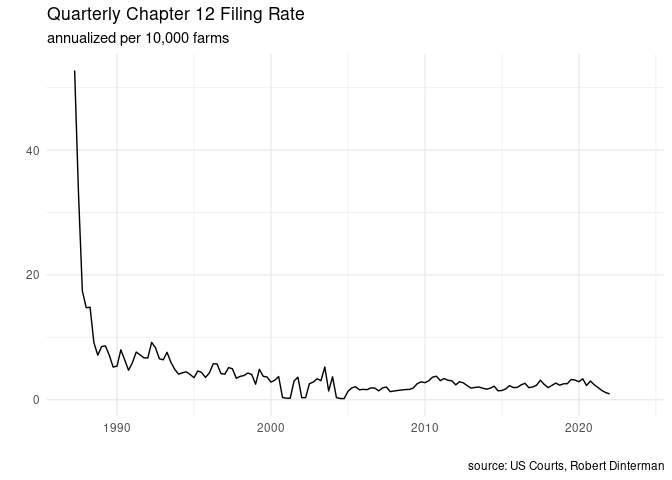
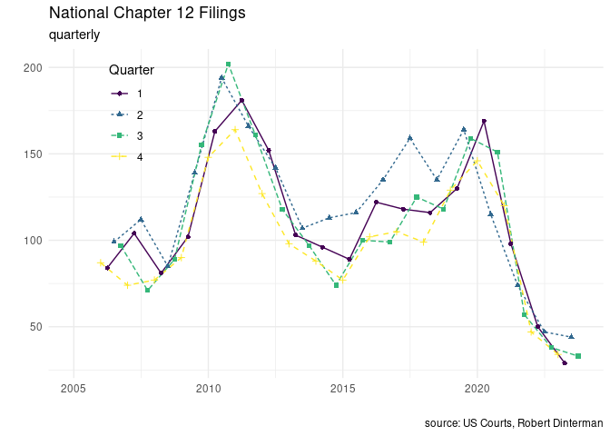
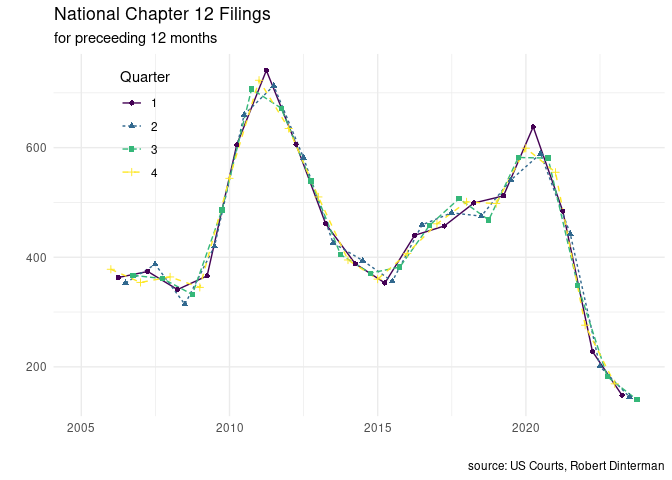
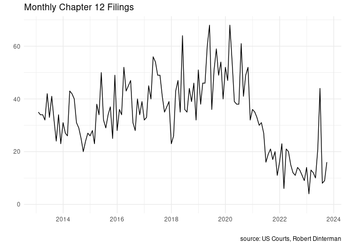
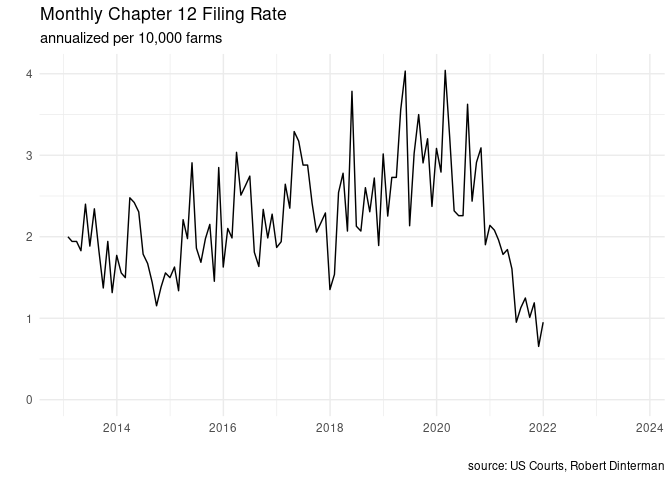

# General Figures of Interest

## Chapter 12 Filings since passage in 1986




## Chapter 12 Filings since Bankruptcy Abuse Prevention and Consumer Protection Act of 2005







## By Federal District Regions


<!-- ## Combined Series -->

<!-- ```{r national-annual-quarterly} -->

<!-- annual_qtr <- quarter_nat %>%  -->

<!--   left_join(annual_nat) %>%  -->

<!--   mutate(year = year(DATE)) %>%  -->

<!--   fill(CHAP_12_nat, .direction = "up") -->

<!-- ``` -->
