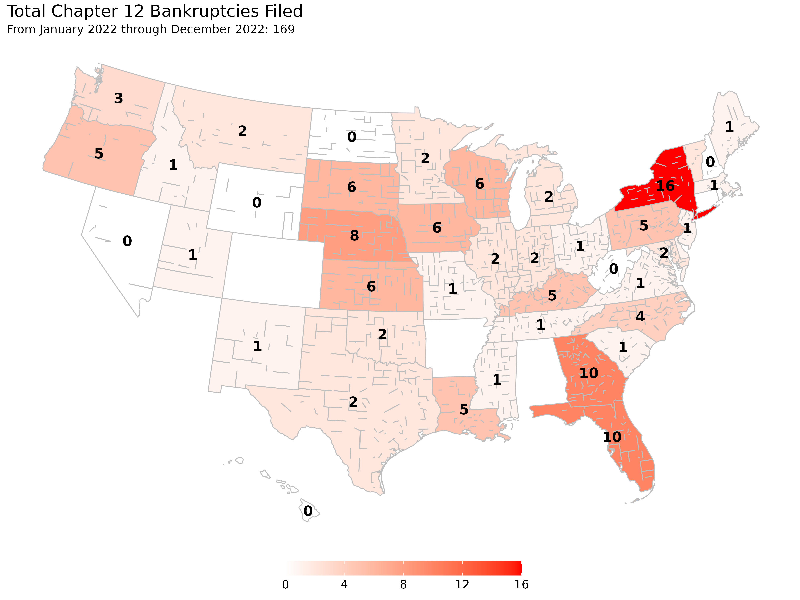

```{r setup, include = FALSE}
#devtools::install_github("rdinter/albersusa")
library("albersusa")
library("knitr")
library("lubridate")
library("scales")
library("sp")
library("tidyverse")
library("zoo")
fyear  <- function(x) year(x) + (month(x) > 9)
opts_chunk$set(echo = FALSE, warning = FALSE)

# Create a directory for the figures
figures  <- "figures"
if (!file.exists(figures)) dir.create(figures, recursive = T)

f2_three    <- read_rds("../0-data/uscourts/f2_three/f2_three.rds") %>% 
  mutate(quarter = quarter(DATE),
         CIRCUIT_NUM = toupper(CIRCUIT_NUM),
         circuit = factor(CIRCUIT_NUM,
                          levels = c("1ST", "2ND", "3RD", "4TH", "5TH", "6TH",
                                     "7TH", "8TH", "9TH", "10TH", "11TH")))
national_q <- read_csv("../1-tidy/bankruptcy/national_quarterly.csv")
national_m <- read_csv("../1-tidy/bankruptcy/national_monthly.csv")
state_farms <- read_csv("../0-data/nass/operations_state.csv")
ers_stats  <- read_csv("../0-data/ers/raw/farmincome_wealthstatisticsdata_february2020.zip", local = locale(encoding = "latin1"))

national_q12 <- mutate(national_q,
                       CHAP_12 = zoo::rollsumr(CHAP_12, k = 4, fill = NA))
```

<!-- Notes: -->

<!-- - publication is for Certified Public Accountants across Georgia. -->
<!-- - A lot of their clientele will be in agriculture which is the number 1 industry in Georgia. -->
<!-- - Hurricane Michael hitting Georgia in 2018 -->
<!--     - Harmed timber, pecan, and row crops in southern Georgia -->
<!--     - Payments haven't necessarily gone out to farmers yet -->
<!-- - Another issue has been tariffs and trade wars, MFP across Georgia -->
<!-- - Talk about Farm Incomes having declined across the nation and state -->
<!-- - Bankruptcy numbers -->

<!-- Topic: Farm Bankruptcy's in Georgia - looking for an article addressing what's going on with the increase, history, anything GA specific, etc - feel free to get creative with a title if you want. -->
<!-- Length: 900 words -->
<!-- Bio: 2-3 sentence bio of the author - you can include an email address if you would like to offer it for questions.  I'll leave this to you. -->
<!-- Deadline: February 7th -->

<!-- --- -->

A continued lower price environment, uncooperative weather events, and trade uncertainty have all contributed to depressed net cash farm income levels and placed upward pressure on farm bankruptcies. The US Courts recently released the bankruptcy filing numbers for the fourth quarter of 2019 which had a total of `r national_q$CHAP_12[national_q$DATE=="2019-12-31"]` chapter 12 bankruptcies filed (or `r national_q12$CHAP_12[national_q12$DATE=="2019-12-31"]` for the year). This represented an increase from the previous year's fourth quarter of `r national_q$CHAP_12[national_q$DATE=="2018-12-31"]` chapter 12 bankruptcy filings. Since 2014, chapter 12 filings have gradually increased year-over-year and has approached levels unseen since 2012. Throughout this time period, Georgia has typically ranked near the top of states with farm bankruptcies.

```{r time}
f2_three %>% 
  group_by(DATE, STATE) %>% 
  summarise(CHAP_12 = sum(impute, na.rm = T)) %>% 
  group_by(STATE) %>% 
  mutate(CHAP_12 = zoo::rollsumr(CHAP_12, k = 4, fill = NA)) %>% 
  filter(DATE > "2005-10-17") %>% 
  ggplot(aes(DATE, CHAP_12)) +
  # geom_line(aes(group = STATE), color = "grey80") +
  geom_point(aes(group = STATE), color = "grey80") +
  geom_point(data = . %>% filter(STATE == "GEORGIA"),
             color = "red", size = 1.5) +
  geom_line(data = . %>% filter(STATE == "GEORGIA"),
            color = "red", size = 1) +
  theme_minimal() +
  scale_x_date(date_labels = "%Y",
               limits = as.Date(c("2005-01-01", "2020-01-01"))) +
  # scale_y_continuous(limits = c(0, 225)) +
  # scale_color_viridis_d() +
  theme(legend.position = c(0.15, 0.8)) + 
  labs(x = "", y = "", shape = "Quarter", linetype = "Quarter",
       title = "Chapter 12 Filings by State",
       subtitle = "for preceding 12 months\nGeorgia bolded red line",
       caption = "source: US Courts")
ggsave(paste0(figures, "/ch12-state-ga.png"), width = 13.3, height = 10)
```


Chapter 12 bankruptcy, more commonly referred to as farm bankruptcy, is a bankruptcy procedure where family farmers or family fishermen can restructure their debts to be repaid over a period of three to five years conditional on income and debt limit requirements being met. The chapter was created in 1986 as a response to the 1980's Farm Crisis as a bankruptcy option for farmers to retain their farm. The chapter was created based on chapter 13 but with higher debt limits to account for the large capital investments in agricultural land required for farming. As many farmers exceeded the chapter 13 debt limits at the time, their only other option to continue farming while filing for bankruptcy was the more complex chapter 11 procedure as a chapter 7 would result in cessation of operation through the liquidation procedure.

For the farm income requirement, at least 50\% of gross income in the previous year, or two of the preceding three years, must arise from commercial agricultural production in order to qualify for chapter 12. This requirement is 80\% if involved in fishing. The requirement is in place as a way to ensure that active family farmers are the main beneficiary of the procedure, however this can lead to issues when a family farmer has required substantial off-farm income in low farm income years.

The farming debt limit for chapter 12 was recently increased to \$10,000,000 with the passage of the Family Farmer Relief Act which was signed into law on August 23, 2019. The prior debt limit was \$4,411,400 as of April 1, 2019 as the debt limit is adjusted once every three years to account for inflation. The Act did not affect the fishing debt limit which was increased to \$2,044,225 on April 1, 2019 to account for inflation.

## Reasons for Filing Chapter 12

There are many factors that influence a farmer's decision to file for bankruptcy, but at the core of the issue is that a farmer is likely to file if their current cash flow does not meet their current debt obligations. It is rarely the case that one specific event is the reason for filing a bankruptcy as the decision is usually based on a series of events which slowly erodes a farmer's equity and places them in an insolvent position. Chapter 12 allows the farmer to continue their operation while restructuring their debts by proposing a payment plan to be repaid over the course of three to five years, although certain long-term debts can be repaid over a longer horizon. Successful completion of a bankruptcy filing leads to the discharging of unsecured debts for the debtor. One of the benificial aspects of a chapter 12 procedure is the ability of a debtor to cram down secured debts whereby a debtor can reduce the amount of a secured debt to the current value of its collateral as unsecured debt is dischargable in a successful bankruptcy filing. While chapters 11 and 13 also allow for a cram down, those chapters are prohibited for cramming down mortgages while chapter 12 is not limited by such prohibition. With over 80\% of a farmer's assets tied up in agricultural land, a chapter 12 cram down can be extremely useful for farmers in areas of declining land values that previously took on debt to finance the purchase of their land as reclassifying secured debt to unsecured debt.

While there has been an increase in chapter 12 filings since 2014, certain areas in the United States have felt more financial stress in agriculture than other areas. In particular, over the past year the upper Midwest has seen a considerale increase in chapter 12 filings with Wisconsin leading the nation in chapter 12 bankruptcies. The main culprit for farm bankruptcies in Wisconsin has been the lagging dairy sector which has suffered low commodity prices due to overproduction in the industry. For other areas in the upper Midwest, the stagnant or declining agricultural land markets that has resulted from multiple years of declining farm income, recently exacerbated from the trade war with China, has contributed towards the increased bankruptcies. However the state tied for the second most bankruptcies in 2019, Georgia, has had a bit more nuance as to why it has experienced higher financial stress than other areas of the country.



## Georgia Farm Financial Issues

At the core of recent financial stress in agriculture for Georgia is its agricultural land market. While the nation as a whole has seen roughly an annaul growth rate of 4\% in agricultural land values since 2009, Georgia has seen a reversed trend with declining land values over this time. In 2009, the national average for agricultural land was \$2,090 per acre while the value for Georgia was \$4,030 according to the USDA. By 2019, the national average steadily increased to \$3,160 per acre while Georgia declined to \$3,470. Due to the benefits of a cram down procedure in a chapter 12 filing, it is clear that chapter 12 filings would increase in an environment with declining agricultural land values although the reasons for these declines in land values are also important.

<!-- National land values: https://quickstats.nass.usda.gov/results/905987AE-1B96-3B03-87AA-F061C9EE755F -->
<!-- GA land values: https://quickstats.nass.usda.gov/results/CBDDE90E-F3EF-340C-A8AA-32559545C70A -->

Agricultural land values are determined by the discounted future stream of income derived from agriculture as well as the option value of converting the land to commercial or residential developments. The vast majority of farmland in Georgia is located outside of metropolitan regions which implies agricultural land values in Georgia are mostly based on market expectations of future farm income. The expectation of future farm income is a mixture of looking at historical performance of commodities on a given land as well as forward looking insight to trends in agriculture which would affect farm income.

The total net cash farm income for Georgia has generally trended in the same direction as total net cash farm income for the entire United States since 2000. Pre-2010, net cash farm income hovered around \$85 billion for the US as a whole while Geogria was around \$2.5 billion. Both the US as a whole and Georgia experienced boom years in 2012 to 2014 thanks in large part to high commodity prices which incentivized an increase in acreage across the country. Due to the increased production, downward pressure in commodity prices began to affect net cash from income resulting in a heavy reduction in net cash farm income beginning in 2015.


```{r ers}
y_factor = 20
ers_stats %>% 
  filter(VariableDescriptionTotal == "Net cash income",
         State %in% c("GA", "US"), Year > 1999, Year < 2019) %>%
  mutate(Amount = ifelse(State == "GA",
                         Amount * y_factor / 1e6, 
                         Amount / 1e6)) %>% 
  ggplot(aes(Year, Amount, group = State,
             color = State, linetype = State, shape = State)) +
  geom_line() +
  geom_point() +
  scale_y_continuous("United States", labels = dollar_format(accuracy = 0.01),
                     sec.axis = sec_axis(~ . / y_factor, name = "Georgia", labels = dollar_format(accuracy = 0.01))) +
  theme_minimal() +
  scale_x_continuous(limits = c(2000, 2020)) + 
  theme(legend.position = "bottom") + 
  labs(title = "Net Cash Farm Income",
       subtitle = "in billions of dollars",
       caption = "source: USDA-ERS",
       color = "", linetype = "", shape = "", x = "")
ggsave(paste0(figures, "/net-cash-farm-income-ga.png"), width = 13.3, height = 10)
```


Since 2016, net cash farm income has been slowly creeping up nationally but has yet to return to the early decade's boom period. Georgia would have likely seen similar increases in their net cash farm income since 2016 if it was not for Hurricane Michael in 2018 which contributed to the decline in net cash farm income from \$3.26 billion in 2017 to \$2.76 billion in 2018. Some of the damages from Hurricane Michael were mitigated through crop insurance as well as Farm Service Agency programs for disaster relief however these programs did not make farmers whole and the disbursement of funds were often delayed.

Included within the net cash farm income of 2018, and subsequently will be within 2019 and 2020, is the Market Facility Program (MFP) payments. MFP provided assistance to farmers and ranchers with commodities directly impacted by foreign retaliatory tariffs. The program was meant as a one time payment enacted in 2018 which compensated cotton, corn, dairy, hogs, sorghum, soybeans, and wheat producers for retalitory tariffs. However, this program was again enacted in 2019 (but paid over 2019 and 2020) due to the elongated trade war and greatly increased its covered commodities and most importantly for Georgia was the inclusion of pecans in MFP for 2019. Uncertainty surrounding a major export market for agricultural producers has greatly affected future expectations in farm incomes and this has been reflected in land markets.

Of the \$104.23 billion in net cash farm income for 2018 about \$13.67 billion were direct goverment payments, a majority of that from MFP. In Georgia, approximatley \$326 million of the \$2.76 billion of net cash farm income for 2018 resulted from government payments. While the United States Economic Research Services (USDA-ERS) does not currently have state level estimates for net cash farm income beyond 2018 at this time, they do have forecasts for national net cash farm income values of \$120.44 billion in 2019 and \$104.22 billion in 2020. The amount of government payments for these years is forecast at \$23.65 billion and \$14.98 billion respectively.

While MFP payments certainly buoyed current cash flow, the program is only a temporary measure and markets have been tepid in expecting future payments. It will not be clear how much Georgia will see in 2019 MFP payments for their farm incomes until USDA-ERS provides their estimates next November, however counties in southern Georgia are expected to receive some of the highest MFP payment rates based largely on pecan production. And although a phase 1 trade deal with China was agreed to this past December, markets have not had a bullish response to this point.

<!-- `r filter(ers_stats, State == "US", Year == 2019, VariableDescriptionTotal == "Value of government payments, total")$Amount` -->


<!-- At the same time, the recent increases in net cash farm income has not outpaced the debt accumulation for farmers. According to the United States Economic Research Services (USDA-ERS), the debt-to-equity ratio reached a historical low in 2012 around 12.7\% but this has steadily increased in recent years to a forecasted 15.7\% in 2020.  -->


----

Author: Robert Dinterman is an agricultural economist the Department of Agricultural, Environmental, and Development Economics at The Ohio State University with a PhD in agricultural economics from North Carolina State University. His current research topics includes farm bankruptcies, farmland values, farm financial condition, beginning farmers and ranchers, and other farm and agribusiness related topics.


<!-- ```{r ers2} -->
<!-- ers_stats %>%  -->
<!--   filter(VariableDescriptionTotal == "Net cash income", -->
<!--          State %in% c("GA", "US"), Year > 1998, Year < 2019) %>% -->
<!--   group_by(State) %>%  -->
<!--   mutate(pct_change = (Amount - lag(Amount)) / lag(Amount)) %>%  -->
<!--   ggplot(aes(Year, pct_change, group = State, -->
<!--              color = State, linetype = State, shape = State)) + -->
<!--   geom_line() + -->
<!--   geom_point() + -->
<!--   theme_minimal() + -->
<!--   scale_x_continuous(limits = c(2000, 2020)) +  -->
<!--   theme(legend.position = "bottom") +  -->
<!--   labs(title = "Net Cash Farm Income", -->
<!--        subtitle = "in billions of dollars", -->
<!--        caption = "source: USDA-ERS", -->
<!--        color = "", linetype = "", shape = "", x = "") -->
<!-- ``` -->
