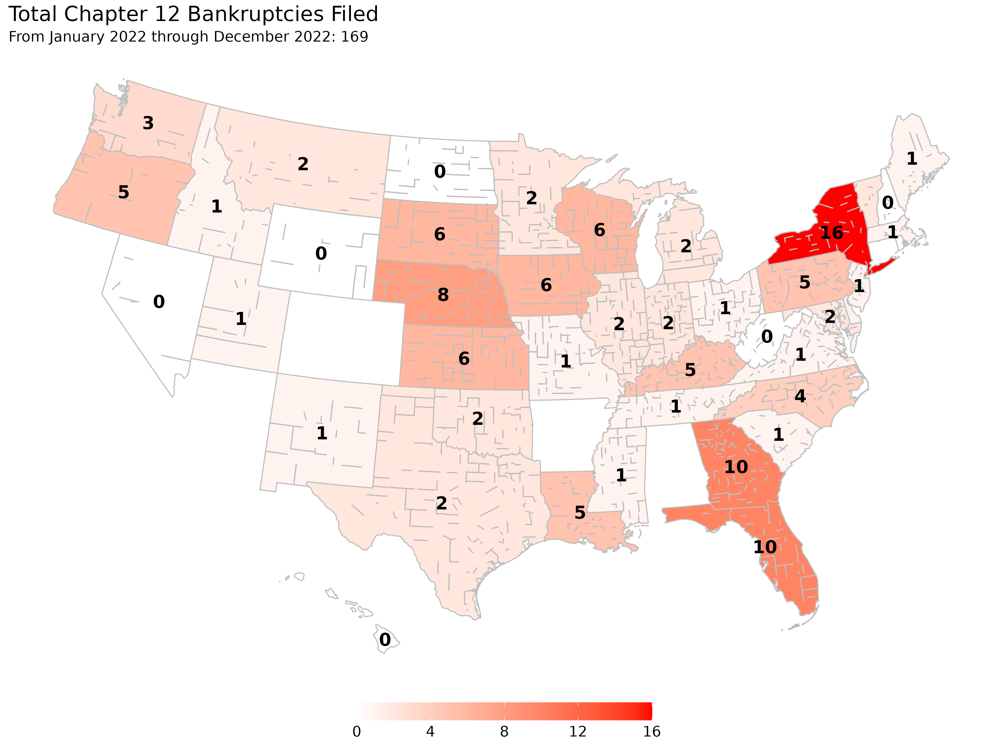

- National farm bankruptcy levels have approached levels not seen since 2009-2012
- Bankruptcy filings have increased in some areas, but still remain relatively low
- Farm and off-farm income levels, farmland value trends, and macroeconomic factors all help determine regional differences in farm bankruptcy levels


```{r setup, include = FALSE}
#devtools::install_github("rdinter/albersusa")
library("albersusa")
library("knitr")
library("lubridate")
library("scales")
library("sp")
library("tidyverse")
library("zoo")
fyear  <- function(x) year(x) + (month(x) > 9)
opts_chunk$set(echo = FALSE, warning = FALSE)

# Create a directory for the figures
figures  <- "figures"
if (!file.exists(figures)) dir.create(figures, recursive = T)

f2_three    <- read_rds("../0-data/uscourts/f2_three/f2_three.rds") %>% 
  mutate(quarter = quarter(DATE),
         CIRCUIT_NUM = toupper(CIRCUIT_NUM),
         circuit = factor(CIRCUIT_NUM,
                          levels = c("1ST", "2ND", "3RD", "4TH", "5TH", "6TH",
                                     "7TH", "8TH", "9TH", "10TH", "11TH")))
national_q <- read_csv("../1-tidy/bankruptcy/national_quarterly.csv")
national_m <- read_csv("../1-tidy/bankruptcy/national_monthly.csv")
state_farms <- read_csv("../0-data/nass/operations_state.csv")
ers_stats  <- read_csv("../0-data/ers/raw/farmincome_wealthstatisticsdata_february2020.zip", local = locale(encoding = "latin1"))

cases <- read_rds("../1-tidy/bankruptcy/ch12_bankruptcy.rds")

date_seq <- seq(as.Date("2007-10-01"), as.Date("2019-09-30") - 1,
                by = "1 week")
caseload2 <- map(date_seq, function(x) {
  summarise(cases, caseload = sum(start < x & close > x),
            casedate = as.Date(x))
}) %>% bind_rows()

date_seq <- seq(as.Date("2007-10-01"), as.Date("2019-09-30") - 1,
                by = "1 month")
caseload3 <- map(date_seq, function(x) {
  summarise(cases, caseload = sum(start < x & close > x),
            casedate = as.Date(x))
}) %>% bind_rows()

national_q12 <- mutate(national_q,
                       CHAP_12 = zoo::rollsumr(CHAP_12, k = 4, fill = NA))
national_q12_impute <- f2_three %>% 
  group_by(DATE) %>% 
  summarise(impute = sum(impute, na.rm = T)) %>% 
  ungroup() %>% 
  mutate(CHAP_12 = zoo::rollsumr(impute, k = 4, fill = NA))
```

A continued lower price environment, uncooperative weather events over the past year, trade uncertainty, and COVID-19 have all contributed to depressed net cash farm income levels and placed upward pressure on farm bankruptcies. Some of the lower net cash farm income has been offset by government payments, however there is still significant financial stress in the agricultural sector. The US Courts recently released the bankruptcy filing numbers for the first quarter of 2020 which had a total of `r national_q$CHAP_12[national_q$DATE=="2002-03-31"]` chapter 12 bankruptcies filed (or `r national_q12$CHAP_12[national_q12$DATE=="2020-03-31"]` for the year). This represented an increase from the previous year's first quarter of `r national_q$CHAP_12[national_q$DATE=="2019-03-31"]` chapter 12 bankruptcy filings even though the COVID-19 pandemic delayed in-person events at bankruptcy courts which suppressed the number of filings in March. Since 2014, chapter 12 filings have gradually increased year-over-year and has approached levels unseen since 2012 although the filings are still substantially below levels prior to 1998.

```{r caseload-monthly}
second_factor = 2
national_m %>% 
  mutate(CHAP_12 = CHAP_12*12) %>% 
  bind_rows(filter(national_q12_impute, DATE < min(national_m$DATE))) %>% 
  select(casedate = DATE, CHAP_12) %>% 
  bind_rows(caseload3) %>% 
  mutate(caseload = caseload/second_factor) %>% 
  gather(var, val, -casedate) %>% 
  filter(!is.na(val), casedate > "1994-12-31") %>% 
  mutate(var = factor(var, labels = c("Caseload", "Filings"))) %>% 
  ggplot(aes(casedate, val, group = var,
             linetype = var, color = var)) +
  geom_point(alpha = 1/3, stroke = 1/3) +
  # stat_smooth(formula = y ~ splines::ns(x,3), method = "lm") +
  stat_smooth(method = "loess", formula = y ~ x, se = FALSE) +
  scale_y_continuous(labels = scales::comma, limits = c(0, NA),
                     sec.axis = sec_axis(~ .*second_factor,
                                         name = "Monthly Caseload",
                                         labels = scales::comma)) +
  scale_x_date(limits = as.Date(c("1995-01-01", NA)),
               date_breaks = "5 years") +
  scale_fill_manual(values = c("#4B6A8A", "#F57D4B")) +
  scale_color_manual(values = c("#4B6A8A", "#F57D4B")) +
  # scale_fill_gradient(high = "#4B6A8A", low = "#F57D4B") +
  # scale_color_viridis_d(end = 0.85) +
  scale_linetype_manual(values = c("dotted", "solid")) +
  theme_minimal() +
  theme(legend.position = "bottom") +
  labs(x = "", y = "Monthly Filing (annualized)", linetype = "", color = "", fill = "",
       title = "National Chapter 12 Trends",
       subtitle = "filings left axis,\ncaseload right axis",
       caption = "source: US Courts")
ggsave(paste0(figures, "/caseload-monthly.png"), width = 13.3, height = 10)
```

# Farm Bankruptcy

Chapter 12 bankruptcy, more commonly referred to as farm bankruptcy, is a bankruptcy procedure where family farmers or family fishermen can restructure their debts to be repaid over a period of three to five years conditional on income and debt limit requirements being met. The chapter was created in 1986 as a response to the 1980's Farm Crisis as a bankruptcy option for farmers to retain their farm. The chapter was created based on chapter 13 but with higher debt limits to account for the large capital investments in agricultural land required for farming. As many farmers exceeded the chapter 13 debt limits at the time, their only other option to continue farming while filing for bankruptcy was the more complex chapter 11 procedure as a chapter 7 would result in cessation of operation through the liquidation procedure.

The farming debt limit for chapter 12 was recently increased to \$10,000,000 with the passage of the Family Farmer Relief Act which was signed into law on August 23, 2019. The prior debt limit was \$4,411,400 as of April 1, 2019 as the debt limit is adjusted once every three years to account for inflation. The Act did not affect the fishing debt limit which was increased to \$2,044,225 on April 1, 2019 to account for inflation. The effects of the increased debt limits have been muted so far as there are less than 1\% of all farmers have debts between the old limit and the new limit. As evidence, only 5 of the 64 cases filed in the period between August 23rd and September 30th of 2019 had more than \$4,411,400 in debts. Relatedly for current filing trends is that the average debt load of filers have been steadily increasing.

## Reasons for Filing Chapter 12

There are many factors that influence a farmer's decision to file for bankruptcy, but at the core of the issue is that a farmer is likely to file if their current cash flow does not meet their current debt obligations. It is rarely the case that one specific event is the reason for filing a bankruptcy as the decision is usually based on a series of events which slowly erodes a farmer's equity and places them in an insolvent position. Chapter 12 allows the farmer to continue their operation while restructuring their debts by proposing a payment plan to be repaid over the course of three to five years, although certain long-term debts can be repaid over a longer horizon. Successful completion of a bankruptcy filing leads to the discharging of unsecured debts for the debtor. One of the beneficial aspects of a chapter 12 procedure is the ability of a debtor to cram down secured debts whereby a debtor can reduce the amount of a secured debt to the current value of its collateral as unsecured debt is dischargable in a successful bankruptcy filing. While chapters 11 and 13 also allow for a cram down, those chapters are prohibited for cramming down mortgages while chapter 12 is not limited by such prohibition. With over 80\% of a farmer's assets tied up in agricultural land, a chapter 12 cram down can be extremely useful for farmers in areas of declining land values that previously took on debt to finance the purchase of their land as reclassifying secured debt to unsecured debt. Declines in agricultural land values are the primary cause for filing a bankruptcy, although negative income shocks, increased debt costs, and unexpected costs also contribute to bankruptcy filings. 

While there has been an increase in chapter 12 filings since 2014, certain areas in the United States have felt more financial stress in agriculture than other areas. In particular, over the past year the upper Midwest has seen a considerable increase in chapter 12 filings with Wisconsin leading the nation in chapter 12 bankruptcies. The main culprit for farm bankruptcies in Wisconsin has been the lagging dairy sector which has suffered low commodity prices due to overproduction in the industry. For other areas in the upper Midwest like Kansas in particular, the stagnant or declining agricultural land markets that has resulted from multiple years of declining farm income, recently exacerbated from the trade war with China, has contributed to their increased bankruptcies.



## Farm Income

Since 2016, net farm income has been slowly creeping up nationally but has yet to return to the early decade's boom period. Included within the net farm income of 2018, and subsequently will be within 2019 and 2020, is the Market Facility Program (MFP) payments. MFP provided assistance to farmers and ranchers with commodities directly impacted by foreign retaliatory tariffs. The program was meant as a one time payment enacted in 2018 which compensated cotton, corn, dairy, hogs, sorghum, soybeans, and wheat producers for retaliatory tariffs. However, this program was again enacted in 2019 (but paid over 2019 and 2020) due to the elongated trade war and greatly increased its covered commodities. Uncertainty surrounding a major export market for agricultural producers has greatly affected future expectations in farm incomes and this has been reflected in land markets.


```{r farm-income}
farm_income <- c("FIAUSNTFI--P" = "Net Farm Income",
                 # "FIAUSNTCI--P" = "Net Cash Farm Income",
                 "GPAUSGPTLVAP" = "Government Payments")

ers_stats %>% 
  filter(State == "US", Year > 1960,
         artificialKey %in% names(farm_income)) %>%
  mutate(var = farm_income[artificialKey],
         val = Amount / ChainType_GDP_Deflator / 1e4) %>% 
  select(Year, var, val) %>% 
  spread(var, val) %>% 
  mutate(`Net Farm Income` = `Net Farm Income` - `Government Payments`) %>% 
  gather(var, val, -Year) %>% 
  mutate(var = fct_reorder(var, desc(val))) %>% 
  ggplot(aes(Year, val, group = var, color = var, fill = var, width = 0.8)) +
  geom_bar(position = "stack", stat = "identity") +
  # stat_summary(fun.y = mean, aes(x = 2000, yintercept = ..y.., group = var),
  #              geom = "hline") +
  scale_y_continuous(labels = scales::dollar_format(accuracy = 0.10)) +
  scale_fill_manual(values = c("#4B6A8A", "#F57D4B")) +
  scale_color_manual(values = c("#4B6A8A", "#F57D4B")) +
  # scale_color_viridis_d() +
  # scale_fill_viridis_d() +
  labs(x = "", y = "", color = "", fill = "",
       title = "Historical Farm Income in Agriculture",
       subtitle = "in billions of 2019 dollars",
       caption = "Source: USDA-ERS") + 
  theme_classic() +
  theme(legend.background = element_rect(fill = "transparent"),
        legend.position = c(0.7, 1))
ggsave(paste0(figures, "/net-cash-farm-income.png"), width = 13.3, height = 10)
```

Of the \$83.78 billion in net farm income for 2018 about \$13.67 billion were direct government payments, a majority of that from MFP. Current estimates for the 2019 and 2020 net farm income are \$93.56 billion and \$96.67 billion respectively with substantial support from government payments (\$23.66 billion and \$14.98 billion). While MFP payments certainly buoyed current cash flow, the program is only a temporary measure and it is unclear the degree of future support although the global factors affecting farm income not only stem from trade wars but also the COVID-19 pandemic. Government support for COVID-19, as through Coronavirus Food Assistance Program (CFAP), will provide up to \$16 billion in direct payments which has yet to be accounted for in the USDA ERS estimates of net farm income. The uncertainty in the distribution of these payments at this time makes it unclear as to how much government payments can hold off the current upward trends in bankruptcy filings.

----

Author: Robert Dinterman is an agricultural economist the Department of Agricultural, Environmental, and Development Economics at The Ohio State University with a PhD in agricultural economics from North Carolina State University. His current research topics includes farm bankruptcies, farmland values, farm financial condition, beginning farmers and ranchers, and other farm and agribusiness related topics.
