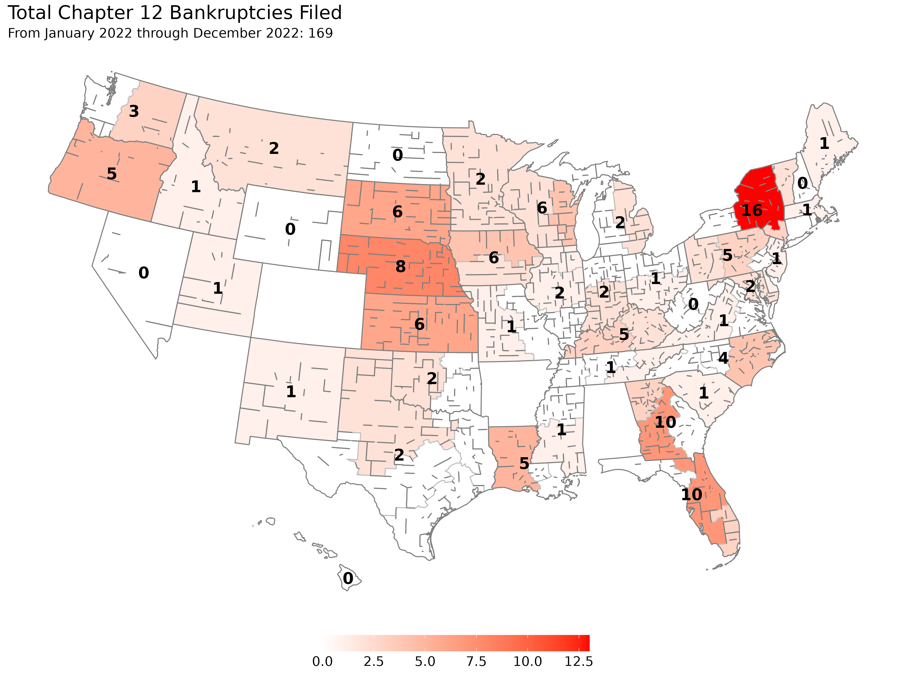

```{r setup, include = FALSE}
#devtools::install_github("rdinter/albersusa")
library("albersusa")
library("knitr")
library("lubridate")
library("sp")
library("tidyverse")
library("zoo")
fyear  <- function(x) year(x) + (month(x) > 9)
opts_chunk$set(echo = FALSE)

f2_three    <- read_rds("../0-data/uscourts/f2_three/f2_three.rds") %>% 
  mutate(quarter = quarter(DATE),
         CIRCUIT_NUM = toupper(CIRCUIT_NUM),
         circuit = factor(CIRCUIT_NUM,
                          levels = c("1ST", "2ND", "3RD", "4TH", "5TH", "6TH",
                                     "7TH", "8TH", "9TH", "10TH", "11TH")))
national_q <- read_csv("../1-tidy/bankruptcy/national_quarterly.csv")
national_m <- read_csv("../1-tidy/bankruptcy/national_monthly.csv")
state_farms <- read_csv("../0-data/nass/operations_state.csv")

j5 <- f2_three %>% 
  filter(YEAR > 2005) %>% 
  select(STATE, YEAR, DATE, FISCAL_YEAR,
         DISTRICT:TOTAL_FILINGS, CHAP_12, impute) %>% 
  left_join(state_farms) %>% 
  mutate(region = tolower(STATE))

us <- map_data("state")

states  <- usa_composite()
states  <- data.frame(toupper(states$name), coordinates(states),
                     stringsAsFactors = F)
names(states) <- c("id", "x", "y")
states <- states %>% 
  filter(!(id %in% c("ALASKA", "HAWAII", "DISTRICT OF COLUMBIA"))) %>% 
  mutate(region = tolower(id))

bank_theme <-   theme(panel.background = element_rect(fill = "transparent"),
                      panel.grid = element_blank(),
                      axis.line = element_blank(),
                      axis.title = element_blank(),
                      axis.ticks = element_blank(),
                      axis.text = element_blank(),
                      legend.position = "bottom",
                      legend.title = element_blank(),
                      legend.key.width = unit(2, "cm"),
                      legend.text = element_text(size = 14),
                      plot.title = element_text(size = 20),
                      plot.subtitle = element_text(size = 14))

alt_theme <- theme(panel.background = element_rect(fill = "transparent"),
                   panel.grid = element_blank(),
                   axis.line = element_blank(),
                   axis.title = element_blank(),
                   axis.ticks = element_blank(),
                   axis.text = element_blank())

```

The US Courts recently released the bankruptcy filing numbers for the second quarter of 2019. The second quarter of 2019 had a total of `r national_q$CHAP_12[national_q$DATE=="2019-06-30"]` chapter 12 bankruptcies filed, which was an increase from the previous year's second quarter of `r national_q$CHAP_12[national_q$DATE=="2018-06-30"]` chapter 12 bankruptcy filings. This represents the third consecutive quarter with an increase in chapter 12 filings over the previous 12 months and the 541 chapter 12 filings in the past 12 months is the highest seen since the second quarter of 2012.

Since 2016, there have been roughly between 450 and 500 chapter 12 filings for the previous 12-month period. While the 541 filings is a recent high and indicative of a sluggish farm economy in recent years, researchers at The Ohio State University are not sounding any alarms at the moment.

```{r time}
f2_three %>% 
  filter(DATE > "2005-10-17") %>% 
  group_by(DATE) %>% 
  summarise(CHAP_12 = sum(impute, na.rm = T),
            Quarter = factor(mean(quarter), levels = c(1, 2, 3, 4))) %>% 
  ggplot(aes(DATE, CHAP_12)) +
  geom_line(aes(group = Quarter, color = Quarter, linetype = Quarter)) +
  # geom_point(data = . %>% filter(qtr == 2)) +
  geom_point(aes(color = Quarter)) +
  theme_minimal() +
  scale_x_date(date_labels = "%Y", limits = as.Date(c("2005-01-01", "2020-01-01"))) +
  scale_y_continuous(limits = c(0, 225)) +
  scale_color_viridis_d() +
  labs(x = "", y = "", title = "National Quarterly Filings of Chapter 12",
       caption = "source: US Courts\nDinterman and Katchova")
```

Chapter 12 bankruptcy, more commonly referred to as farm bankruptcy, is a bankruptcy procedure where family farmers or family fisherman can restructure their debts to be repaid over a period of three to five years conditional on income and debt limit requirements being met. There are many factors which influence a farmer's decision to file for bankruptcy, but at the crux of the issue is that a farmer is likely to file if their current cash flow does not meet their current debt obligations.

"Aside from 2017, the net farm income in the US has decreased every year since 2013 and is currently about 50% of the historical highs of 2013," says Ani Katchova, Associate Professor and Farm Income Enhancement Chair at The Ohio State University. "While the farm balance sheet still has a debt-to-asset ratio which is in acceptable ranges, the sustained low income is putting strain on farmers, especially the highly indebted ones."

Katchova mentions that certain sectors of the farm economy are doing worse than others, which contributes to differing filing rates across the US. In particular, the dairy industry has been struggling for multiple years and soybean farmers are feeling the effects of lower prices and adverse weather this year.



The top states for chapter 12 filings are concentrated in the Midwest, which also features a significant portion of the agricultural activity in the US. Robert Dinterman, post-doctoral researcher in agribusiness at The Ohio State University, emphasizes that a major factor for increased chapter 12 bankruptcies in the Midwest is tied to declining land values in these states.

"Kansas and Nebraska in particular have had declining agricultural land values every year since 2014, which is a red flag for chapter 12 filings," Dinterman states. "The procedural nature of a chapter 12 allows for a reorganizing of debt to market value and agricultural land generally accounts for over 80 percent of total farm assets. Declines in agricultural land values greatly erode a farmers' assets while their debts remain roughly the same, which is a recipe for filing for chapter 12."

Dinterman clarifies that a chapter 12 filing does not imply that a farm has ceased operation and underscores that for a farm to make a successful chapter 12 filing they must have continued operation. Farmers clearly prefer to avoid filing for chapter 12, but it is still better than liquidating their assets and walking away from their family farm like would happen in a chapter 7 bankruptcy filing. He also points out other procedural issues related to chapter 12 have consequences on the number of bankruptcy filings.

"Debt limits for all forms of bankruptcy are updated once every three years to adjust for inflation," says Dinterman. "This past April 1^st^, the debt limit was adjusted for chapter 12 to \$4,441,400 from the previous adjustment in 2016 of \$4,153,150. A portion of the increase in chapter 12 filings can be attributed to the debt limit adjustment."

Dinterman points out that the most recent April had `r national_m$CHAP_12[national_m$DATE == "2019-04-30"]` versus `r national_m$CHAP_12[national_m$DATE == "2018-04-30"]` filings a year ago while the June filings for 2019 and 2018 were identical with `r national_m$CHAP_12[national_m$DATE == "2019-06-30"]` filings. He reiterated that the debt limit increase does not explain everything and the current agricultural conditions certainly contribute.

Overall, researchers at The Ohio State University have a cautious outlook on chapter 12 filings. With the Federal Reserve recently announcing a cut in interest rates, loans should be more easily available to farmers and agricultural land values should see a corresponding uptick. While the researchers are not sounding any alarms for a farm crisis, they are closely monitoring agricultural land values, agricultural lending, and net income forecasts for signs of financial stress in the agricultural economy.

<!-- # Is this a usable map instead? -->

<!--  -->


