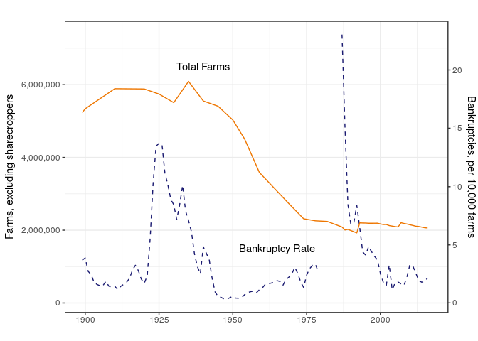

```{r start, include = FALSE}
library("knitr")
library("lubridate")
library("tidyverse")

qtr_data <- read_rds("0-data/uscourts/f2_three/f2_three.rds") %>% 
  mutate(quarter = quarter(DATE))

ch12_limits <- tribble(
  ~`Date Effective`, ~`Farmer Debt Limit`, ~`Fishermen Debt Limit`,
  "1986-11-26", "$1,500,000", "NA",
  "2005-10-15", "$3,237,000", "$1,500,000",
  "2007-04-01", "$3,544,525", "$1,642,500",
  "2010-04-01", "$3,792,650", "$1,757,475",
  "2013-04-01", "$4,031,575", "$1,868,200",
  "2016-04-01", "$4,153,150", "$1,924,550",
  "2019-04-01", "$4,411,400", "$2,044,225"
)
# Updates: Title 11 Chapter 1 Sec. 104 http://uscode.house.gov/browse/prelim@title11/chapter12/subchapter1&edition=prelim
```

```{r global_options, include=FALSE}
opts_chunk$set(cache = FALSE, echo = FALSE, warning = FALSE,
               message = FALSE, out.height = "100%", out.width = "100%")
```

# Frequently Asked Questions

## Where does the bankruptcy data come from?

[US Courts](https://www.uscourts.gov/statistics-reports/caseload-statistics-data-tables) provide quarterly summaries of total bankruptcies filed in the United States going back to 2001 at the district level. Further, the [Federal Judicial Center](https://www.fjc.gov/research/idb/bankruptcy-cases-filed-terminated-and-pending-fy-2008-present) contains individual level filing statistics from October 1, 2007 onward. These are the two main sources along with the [PACER](https://www.pacer.gov/), which hosts all documents related to filed bankruptcies, related to bankruptcies in the United States.

## Are chapter 12 bankruptcy filings the best numbers to look at to evaluate farming-related bankruptcies?

Chapter 12 bankruptcies can only be filed by farmers or fishermen. To qualify, they must meet the [income and debt requirements](https://www.uscourts.gov/services-forms/bankruptcy/bankruptcy-basics/chapter-12-bankruptcy-basics). The income requirement is that more than 50\% (80\% for fishermen) of gross income in the previous tax year comes from farming, although this can also be satisfied if 2 of the previous 3 tax years meet this criteria. The debt requirement is that at least 50\% (80\% for fishermen) of outstanding debt is related to farming and total debts do not exceed the debt limit which is currently set at \$4,411,400 (\$2,044,225 for fishermen). This is a more strict definition of a farm than what the USDA enforces which ensures filers of chapter 12 would be classified as farmers or fishermen.

However, farmers and fishermen are not limited to only file for chapter 12 bankruptcy especially those that do not satisfy the income and/or debt tests. They can and do also file for chapter 7, 11, and 13 bankruptcies. Chapter 12 bankruptcies are only a subset of all bankruptcy cases filed by farmers and should be seen as a lower bound estimate for number of farm bankruptcies. Due to data limitations, it is not feasible to track all of the farmers and fishermen filing for chapter 7, 11, and 13.

```{r ch12-debt-limits, results = "asis"}
kable(ch12_limits, caption = "Chapter 12 Debt Limits Over Time")
```

## What are bankruptcy trends in recent years?

As of recent, [bankruptcies have stabilized](https://aede.osu.edu/news/farm-bankruptcies-are-stabilizing). Since the passage of the Bankruptcy Abuse Prevention and Consumer Protection Act (BAPCPA) of 2005, there was a run-up of chapter 12 filings around 2009 to 2012 but the levels before and after that time have been similar. The 2005 date is important because prior to 2005 chapter 12 was only a temporary aspect of the bankruptcy code and had much lower debt limits.

```{r}
qtr_data %>% 
  filter(DATE > "2005-10-17") %>% 
  group_by(DATE) %>% 
  summarise(CHAP_12 = sum(impute, na.rm = T),
            Quarter = factor(mean(quarter), levels = c(1, 2, 3, 4))) %>% 
  ggplot(aes(DATE, CHAP_12)) +
  geom_line(aes(group = Quarter, color = Quarter, linetype = Quarter)) +
  # geom_point(data = . %>% filter(qtr == 2)) +
  geom_point(aes(color = Quarter, shape = Quarter)) +
  theme_minimal() +
  scale_x_date(date_labels = "%Y",
               limits = as.Date(c("2005-01-01", "2020-01-01"))) +
  # scale_y_continuous(limits = c(0, 225)) +
  scale_color_viridis_d() +
  theme(legend.position = c(0.15, 0.8)) + 
  labs(x = "", y = "", shape = "Quarter", linetype = "Quarter",
       title = "National Chapter 12 Filings")
```

```{r}
qtr_data %>% 
  filter(YEAR > 2005, YEAR < parse_number(format(Sys.Date(), "%Y"))) %>% 
  group_by(YEAR) %>% 
  summarise("Annual Chapter 12" = sum(impute, na.rm = T)) %>% 
  rename(Year = YEAR) %>% 
  kable()
```

## How do farmer bankruptcies compare to the 1980s when the farm crisis was in effect?

Chapter 12 filings in the 1980s are not directly comparable to those in recent years for several reasons. For one, it is easier to file for chapter 12 since the 2005 Bankruptcy Abuse Prevention and Consumer Protection Act (BAPCPA). Prior to 2005, chapter 12 was not actually a permanent fixture in the bankruptcy code (but Congress kept extending the chapter and there were only a few instances where it lapsed) and had a debt limit of \$1,500,000 from 1986 to October of 2005 and the requirement that at least 80\% of the debts were related to farming. Once BAPCPA was passed, chapter 12 became a permanent fixture and the debt limits increased to \$3,237,000 and updated every 3 years to adjust for inflation (most recently, the debt limit increased to \$4,153,150 in April of 2017) and only 50\% of debts must be related to farming. Further, BAPCPA lessened the income requirements for farmers and expanded protections that allowed fishermen to file for chapter 12 where prior to 2005 fishermen could not file for chapter 12 bankruptcy. The income requirement prior to 2005 was that at least 50\% of gross income in the previous tax year was related to farming but this can now be fulfilled by farming related income comprising 50\% of gross income in 2 of the previous 3 years.

[Figure 1 in our paper](https://aede.osu.edu/sites/aede/files/publication_files/FarmBankruptciesPaper.pdf) displays the historical farmer bankruptcy rate -- please note that chapter 12 did not exist prior to 1986 and the farmer bankruptcy rate prior to that is also not directly comparable. Prior to 1980, bankruptcy filings recorded the occupation of the filer and thus the pre-1980 bankruptcy rate for farmers included farmers which filed for chapters 7, 11, and 13 while from 1986 and beyond only include chapter 12.




---
