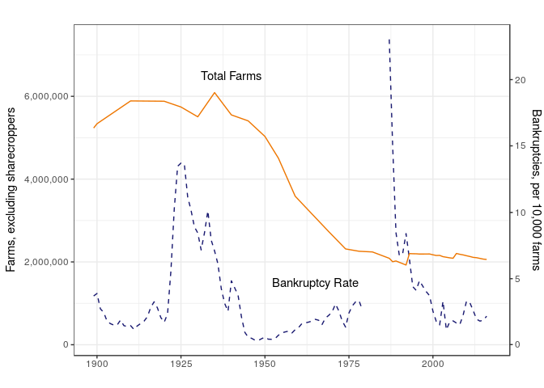

Frequently Asked Questions
==========================

Where does the bankruptcy data come from?
-----------------------------------------

[US
Courts](https://www.uscourts.gov/statistics-reports/caseload-statistics-data-tables)
provide quarterly summaries of total bankruptcies filed in the United
States going back to 2001 at the district level. Further, the [Federal
Judicial
Center](https://www.fjc.gov/research/idb/bankruptcy-cases-filed-terminated-and-pending-fy-2008-present)
contains individual level filing statistics from October 1, 2007 onward.
These are the two main sources along with the
[PACER](https://www.pacer.gov/), which hosts all documents related to
filed bankruptcies, related to bankruptcies in the United States.

Are chapter 12 bankruptcy filings the best numbers to look at to evaluate farming-related bankruptcies?
-------------------------------------------------------------------------------------------------------

Chapter 12 bankruptcies can only be filed by farmers or fishermen. To
qualify, they must meet the [income and debt
requirements](https://www.uscourts.gov/services-forms/bankruptcy/bankruptcy-basics/chapter-12-bankruptcy-basics).
The income requirement is that more than 50% (80% for fishermen) of
gross income in the previous tax year comes from farming, although this
can also be satisfied if 2 of the previous 3 tax years meet this
criteria. The debt requirement is that at least 50% (80% for fishermen)
of outstanding debt is related to farming and total debts do not exceed
the debt limit which is currently set at $4,153,150 ($1,924,550 for
fishermen). This is a more strict definition of a farm than what the
USDA enforces which ensures filers of chapter 12 would be classified as
farmers or fishermen.

However, farmers and fishermen are not limited to only file for chapter
12 bankruptcy especially those that do not satisfy the income and/or
debt tests. They can and do also file for chapter 7, 11, and 13
bankruptcies. Chapter 12 bankruptcies are only a subset of all
bankruptcy cases filed by farmers and should be seen as a lower bound
estimate for number of farm bankruptcies. Due to data limitations, it is
not feasible to track all of the farmers and fishermen filing for
chapter 7, 11, and 13.

| Date Effective | Farmer Debt Limit | Fishermen Debt Limit |
|:---------------|:------------------|:---------------------|
| 1986-11-26     | $1,500,000        | NA                   |
| 2005-10-15     | $3,237,000        | $1,500,000           |
| 2008-04-01     | $3,544,525        | $1,642,500           |
| 2011-04-01     | $3,792,650        | $1,757,475           |
| 2014-04-01     | $4,031,575        | $1,868,200           |
| 2017-04-01     | $4,153,150        | $1,924,550           |

What are bankruptcy trends in recent years?
-------------------------------------------

As of recent, [bankruptcies have
stabilized](https://aede.osu.edu/news/farm-bankruptcies-are-stabilizing).
Since the passage of the Bankruptcy Abuse Prevention and Consumer
Protection Act (BAPCPA) of 2005, there was a run-up of chapter 12
filings around 2009 to 2012 but the levels before and after that time
have been similar. The 2005 date is important because prior to 2005
chapter 12 was only a temporary aspect of the bankruptcy code and had
much lower debt limits.

|  Year|  Annual Chapter 12|
|-----:|------------------:|
|  2006|                354|
|  2007|                364|
|  2008|                345|
|  2009|                544|
|  2010|                723|
|  2011|                635|
|  2012|                510|
|  2013|                395|
|  2014|                360|
|  2015|                407|
|  2016|                461|
|  2017|                501|
|  2018|                498|

How do farmer bankruptcies compare to the 1980s when the farm crisis was in effect?
-----------------------------------------------------------------------------------

Chapter 12 filings in the 1980s are not directly comparable to those in
recent years for several reasons. For one, it is easier to file for
chapter 12 since the 2005 Bankruptcy Abuse Prevention and Consumer
Protection Act (BAPCPA). Prior to 2005, chapter 12 was not actually a
permanent fixture in the bankruptcy code (but Congress kept extending
the chapter and there were only a few instances where it lapsed) and had
a debt limit of $1,500,000 from 1986 to October of 2005 and the
requirement that at least 80% of the debts were related to farming. Once
BAPCPA was passed, chapter 12 became a permanent fixture and the debt
limits increased to $3,237,000 and updated every 3 years to adjust for
inflation (most recently, the debt limit increased to $4,153,150 in
April of 2017) and only 50% of debts must be related to farming.
Further, BAPCPA lessened the income requirements for farmers and
expanded protections that allowed fishermen to file for chapter 12 where
prior to 2005 fishermen could not file for chapter 12 bankruptcy. The
income requirement prior to 2005 was that at least 50% of gross income
in the previous tax year was related to farming but this can now be
fulfilled by farming related income comprising 50% of gross income in 2
of the previous 3 years.

[Figure 1 in our
paper](https://aede.osu.edu/sites/aede/files/publication_files/FarmBankruptciesPaper.pdf)
displays the historical farmer bankruptcy rate – please note that
chapter 12 did not exist prior to 1986 and the farmer bankruptcy rate
prior to that is also not directly comparable. Prior to 1980, bankruptcy
filings recorded the occupation of the filer and thus the pre-1980
bankruptcy rate for farmers included farmers which filed for chapters 7,
11, and 13 while from 1986 and beyond only include chapter 12.

------------------------------------------------------------------------
